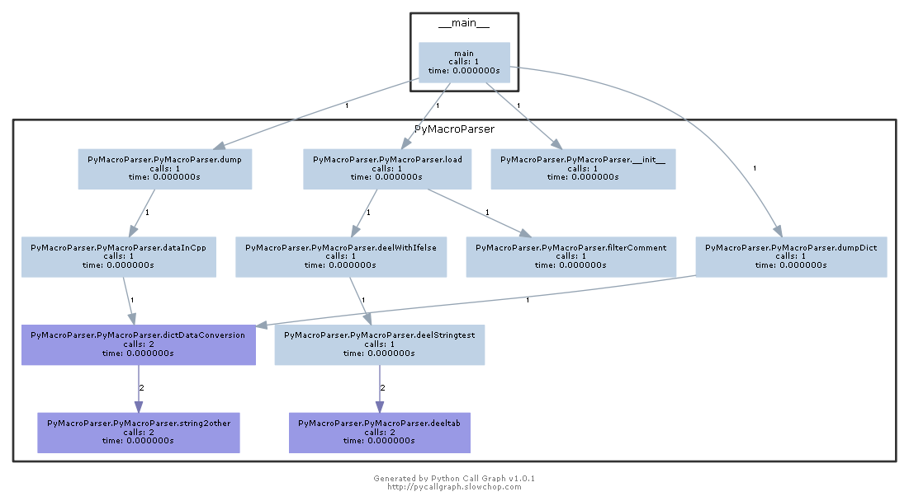

# PyMacroParser : 对.cpp文件内宏定义批量处理及类型转换


## 规定要求：

1. 该类能读取 .cpp文件中的宏定义，并接收可变化的预定义宏串， 并根据两者，解析出当前所有的可用的宏定义。
2. 可用宏定义可转为Python字典模式输出。 其中宏名转为字符串作为字典key, 若有与宏对应的常量定义转为对应python数据类型后作为字典的value。 类型对应关系见后表。若无任何常量则value为None
3. 可用宏定义可再次导出成为只含有当前宏定义的CPP源文件。
4. 请遵循CPP宏及常量类型的定义标准，确保相同常量变换后数值上保持一致，类型上与Python保持兼容（由于python转换过程中可能会损失掉C的具体类型信息，比如char 可能最终变为 int，具体表示方法也会有所变化，比如16进制最终表示为10进制， 故多次转换后能保持最终常量的值相等即可。 类型转换标准见“注意”）
5. *只允许使用Python内置模块（如sys、math）和string模块，不允许使用其他标准模块及任何第三方开发库（包括但不限于re），不要使用 evel/excec 懒人解析， 不要使用copy；deepcopy等懒人复制。*
6. 独立完成作业，并附带测试代码及一份简短的模块使用说明

## 以下简单介绍所写函数模块功能



* load（self，f）：

  从指定文件中读取CPP宏定义，存为python内部数据，以备进一步解析使用。f为文件路径，文件操作失败则抛出异常。读取文件后调用函数filterComment，作用是过滤掉cpp文件中可能出现的注释内容，包括多行注释，单行注释以及折行注释。返回的字符串再调用内部函数deelWithIfelse（用于处理cpp中出现宏定义中宏指令的逻辑关系Ifdef-else-endif，ifndef-else-endif，define及undef）。经过此函数，会改变PyMacroParser类中的myMacro字符串常量，并在类内部存储一个字典，字典内容是宏定义name：cpp字符串，其中类型还没有转换到python相应数据类型。

* dumDict（self）：

  此函数中主要调用了DataConversion函数，对所存储起来的字典内容进行转换，最后返回一个dict，结合类中存储的CPP宏定义与预定义的宏序列，解析输出所有的可用宏到一个字典，其中宏名转为字符串后作为字典的key。

* dump（self，f）：

  结合类中的CPP宏定义数据与预定义宏序列，解析输出所有可用宏存储到新的CPP源文件，f为CPP文件路径，文件若存在则覆盖，文件操作失败抛出异常。此函数同样是对存储的字典进行数据转换，主要使用dataInCpp函数，形成cpp类型数据模式，并写入指定文件路径。

* filterComment（self，l）：

  此函数主要使用于过滤cpp中的注释内容，使用状态机编写，其中状态分别为

  ```python
  ### state
  ### 0  正常代码
  ### 1  斜杠
  ### 2  多行注释
  ### 3  多行注释中出现'*'
  ### 4  单行注释
  ### 5  折行注释
  ### 6  字符
  ### 7  字符中的转义字符
  ### 8  字符串
  ### 9  字符串中的转义字符
  ```

  函数最后返回的是没有注释的长段字符串。

* deelWithIfelse（self，l）：
  此函数主要功能为处理宏定义的逻辑部分，过滤掉ifdef，undef，else这些没有作用的词和在逻辑中没有被定义的宏定义内容。首先进入函数的是一整串字符串，所以用deelStringtest处理字符串。然后对关键字进行栈处理，进入栈的内容加以状态表示（light表示内容高亮，可以使用；dark表示内容被无视，采用vs中的表示）最后函数返回的是此cpp中确定被定义的宏定义。

* deelStringtest（self，macro）：

  此函数主要用于处理字符串，去除空行做列表管理list[0] = keywords ; list[1] = name ; list[2] = value。其中对行进行切割用了存读再使用readline（）的方法。其中对每行进行deeltab（）的特殊操作，然后根据空格对整行进行分割。

* deeltab（self，s）：

  此函数用于在分割字符串时处理\t的特殊字符，要特别注意排除\t在引号中作为字符串字符常量的情况。

* diactDataConversion（self，d）：

  此函数用于对字典中的value进行数据转换，主要通过string2other函数。

* string2other（self，s）：

  字符串转换函数，对输入的字符串进行分类，对不同的情况进行不同的处理，最后输出对应的数据类型。判断分支主要以下：

  ```python
  if s == '':
      return s
  elif s == 'false':  # bool
      return False
  elif s == 'true':
      return True
  elif s == 'None':
      return None
  elif s[0] == '\'' and s[-1] == '\'':...  # 字符常量
  elif s[0] == '\"' and s[-1] == '\"':...  # 字符串
  elif s[0] == 'L' :...  #宽字符
  elif s[0] == '{' :...	#聚合
  elif s[0] == '-' or s[0] == '+':...	# 带符号整型和浮点
  else:...# 不带符号整型和浮点
  ```

* dataInCpp（self，d）：

  此函数用于对字典中的value进行转换，形成cpp中的数据类型。主要调用了dictDataConversion函数，然后再对字典中的python数据类型进行分类转换，特别要注意的是tuple类型比较特殊，用tuple2cpp进行特殊处理。

* tuple2cpp（self，t，l）：

  由于处理tuple比较特殊，需要进行递归操作，所以在dataInCpp外面特殊写了一个函数，其中tuple包括了不同的数据类型，所以需要针对性分类操作。

## 编码感受

出题人非常用心，考虑了比较多的情况，其中转义字符的处理和聚合类型的转换个人觉得是最麻烦的地方。但是评测系统由于黑盒，报出的错误可能会是有各种原因，编码还好，却花去了比较多的时间debug，找不到原因的痛苦太难受T-T。之前使用python不算特别多，这一次也算很好的体验了一下，总体做下来过程比较痛苦，最后还是很有成就感的，编码略拙，文档粗糙，老师们评判手下留情，谢谢啦~~~